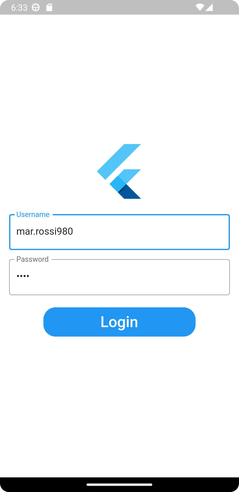

# SPES PF-Client

Un client mobile per il sistema SPES, sviluppata in flutter.

Autori:
- **Luca Gregori**
- **Alessandro Wood**

Alcuni Screenshots:

<p float="left">
  
   
</p>

## Getting Started

### Prerequisiti

- [Flutter](https://docs.flutter.dev/get-started/install/) 3.3.7 
- Android SDK version 33.0.0
- [Android Studio](https://developer.android.com/studio)
- [SPES-server](https://github.com/rtorlone/SPES)

### Installazione dipendenze
All'interno della cartella del progetto eseguire il comando per installare le dipendenze:
```shell
flutter pub get
```
Per generare le classi serializzate relative al modello eseguire il commando:
``` shell
flutter pub run build_runner build --delete-conflicting-outputs
```
In caso di problemi, reinstallare le dipendenze:
``` shell
flutter clean
flutter pub get
```

### Configurazioni extra

Per verificare il corretto funzionamento dell'ambiente di sviluppo (flutter e android studio)
``` shell
flutter doctor
```

Per accettare la licenza di android.
``` shell
flutter doctor --android-license
```

Per indicare a flutter l'installazione di Android Studio :
``` shell
flutter doctor config --adroid-studio-dir path_to_android_studio
```
In caso di installazione di Android Studio tramite flatpak:
```
path_to_android_studio=/var/lib/flatpak/app/com.google.AndroidStudio/current/active/files/extra
```

#### Android SDK
Si consiglia di installare Android SDK uilizzando l'interfaccia dell'IDE Android Studio.

### API
All'interno del file ```lib/services/api.dart``` modificare la seguente variabile:
```dart
static const String basePath = r'http://localhost:8080';
```
sostituire ```localhost:8080``` con URL che espone le chiamate REST del *backend*.
Qualora si decida di eseguire l'app all'interno di un emulatore usare l'indirizzo ```10.0.2.2``` come alias per ```localhost```.